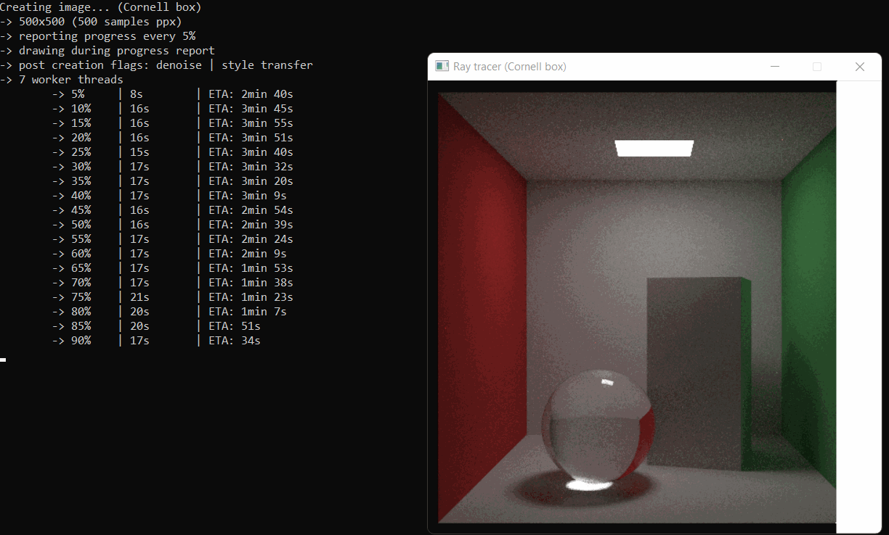

# raytracer
Raytracer with visualization using SDL, following [the tutorial](https://raytracing.github.io).

Features:
  - raytracing of simple objects (sphere, rectangle, triangle) and custom 3D models (in .obj format)
  - displaying progress in window using SDL and saving to file
  - parallelization using OpenMP
  - modifying the resulting image using neural network models (complete python environment is included):
    - denoise (Maxim)
    - style transfer
    - increase resolution (ESRGAN)

The python environment (`python` directory) and neural network models (`models` directory) aren't required and can be removed.

